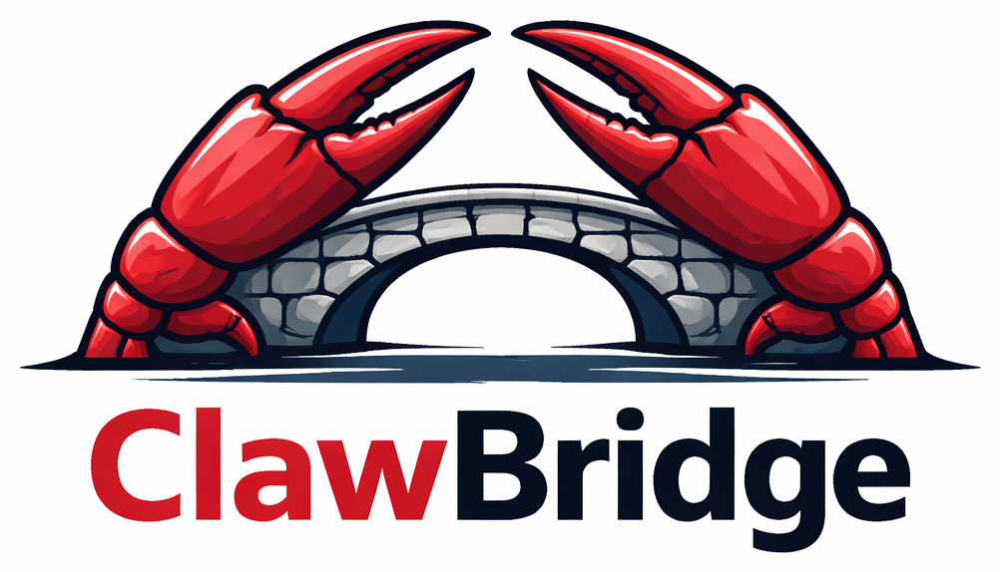

<p align="center">
  
</p>

# ClawBridge

A host-side HTTP bridge that exposes [Claude Code](https://claude.ai/claude-code) as a supervised build tool for automation systems like [OpenClaw](https://github.com/openclaw). It runs on the host machine and provides a JSON API for spawning, managing, and interacting with Claude Code sessions — with structured permission review.

## What Problem It Solves

OpenClaw runs its own AI engine (OpenAI Codex) inside a Docker container. It acts as the **architect** — deciding what to build and why. But it needs a **builder** that can write code, run tests, and interact with the filesystem on the host.

Claude Code is an excellent builder, but it runs on the host as a CLI tool — not inside the container. ClawBridge sits on the host as a lightweight HTTP service that bridges the gap, letting the orchestrator invoke Claude Code as a build tool while maintaining structured permission oversight.

> **Note on Anthropic's third-party policy:** In January 2026, Anthropic [banned the use of Claude subscription OAuth tokens (Pro/Max) in third-party tools](https://www.theregister.com/2026/02/20/anthropic_clarifies_ban_third_party_claude_access/) — this was about token arbitrage, where third-party harnesses routed through cheaper subscription auth instead of API pricing. ClawBridge does **not** do this. It invokes Claude Code on the host as a build tool using proper API key authentication (`claude setup-token`), which is the [explicitly permitted path](https://code.claude.com/docs/en/legal-and-compliance) for developers building products that interact with Claude. ClawBridge does not replace OpenClaw's engine, spoof Claude Code's harness, or use subscription credentials — it's a tool invocation bridge, not an engine substitution.

- **v1 (legacy):** Fire-and-forget. Spawns Claude Code with `--print --dangerously-skip-permissions`, captures output, returns it. No permission review.
- **v2 (PTY broker):** Interactive. Spawns Claude Code in a real PTY, detects permission prompts from TUI output, and lets OpenClaw approve or deny each one as an intelligent reviewer (NHE-ITL).

v2 is the active system. v1 remains for simple one-shot tasks.

## Architecture

```
+--------------------------------------+
|  OpenClaw Container (Docker)         |
|  Role: Architect / NHE-ITL           |
|                                      |
|  Drives builds via HTTP calls        |
|  to ClawBridge                       |
+----------------+---------------------+
                 | HTTP (JSON API, Bearer token)
                 | http://host.docker.internal:<port>
                 v
+--------------------------------------+
|  ClawBridge (host machine)           |
|  Node.js HTTP service                |
|  launchd/systemd managed             |
|                                      |
|  v1: one-shot --print execution      |
|  v2: PTY broker with permission      |
|      detection, policy evaluation,   |
|      and structured event stream     |
+----------------+---------------------+
                 | PTY / child process
                 v
+--------------------------------------+
|  Claude Code                         |
|  Interactive TUI session             |
|  Permission prompts surfaced via     |
|  the bridge's event stream           |
+--------------------------------------+
```

### v2 PTY Broker Flow

1. OpenClaw starts a session via `POST /v2/session/start` with an approval envelope
2. ClawBridge spawns Claude Code in a PTY
3. Claude Code works, triggering permission prompts for file writes, shell commands, etc.
4. The bridge's permission parser detects prompts from raw PTY output
5. The policy engine evaluates each permission against the approval envelope:
   - **auto_approve:** Bridge sends Enter (`\r`) after 500ms delay
   - **deny:** Bridge sends Escape (`\x1b`) after 500ms delay
   - **require_review:** Bridge pauses and surfaces the permission via the event stream
6. OpenClaw polls `GET /v2/session/output` to see events and pending permissions
7. For permissions requiring review, OpenClaw responds via `POST /v2/session/respond`
8. Session ends via `POST /v2/session/end` with optional transcript export

## Dependencies

- **Node.js** >= 18 (tested on v22)
- **node-pty** — native PTY management (requires native addon rebuild)
- **vitest** — test runner (dev dependency)
- **Claude Code** — installed on the host at a known path
- **macOS** with launchd (or Linux with systemd)

## Quickstart

### Requirements

- Node.js 18+
- Claude Code CLI installed on the host
- A valid Claude Code auth token configured via `claude setup-token`
- Build tooling needed by `node-pty` on your host

### 1. Clone and install

```bash
git clone https://github.com/Jason-Vaughan/ClawBridge.git
cd ClawBridge
npm install
npx node-gyp rebuild
```

### 2. Configure environment

```bash
cp bridge/.env.example bridge/.env
```

Edit `bridge/.env` and set at minimum:

```env
BRIDGE_PORT=3201
BRIDGE_TOKEN=replace-me
CLAUDE_CODE_OAUTH_TOKEN=replace-me
```

Optional overrides:

```env
CLAUDE_BIN=/usr/local/bin/claude
PYTHON_BIN=/usr/bin/python3
```

### 3. Start the bridge

For local/manual testing:

```bash
cd bridge
node server.js
```

### 4. Health check

```bash
curl http://localhost:3201/health
```

### 5. Try a one-shot Claude run

```bash
curl -X POST http://localhost:3201/claude/run \
  -H "Content-Type: application/json" \
  -H "Authorization: Bearer $BRIDGE_TOKEN" \
  -d '{
    "prompt": "Reply with exactly: ClawBridge is working",
    "workDir": "/tmp",
    "timeout": 60000
  }'
```

### 6. Deploy as a service

For persistent deployment, use launchd (macOS) or systemd (Linux) below.

## Environment Variables

| Variable | Required | Description |
|----------|----------|-------------|
| `BRIDGE_PORT` | Yes | Port to listen on (default: 3201) |
| `BRIDGE_TOKEN` | Yes | Bearer token for API authentication |
| `CLAUDE_CODE_OAUTH_TOKEN` | Yes | Token from `claude setup-token` for headless auth |
| `CLAUDE_BIN` | No | Path to Claude Code binary (default: `/usr/local/bin/claude`) |
| `PYTHON_BIN` | No | Path to Python 3 binary (default: `/usr/bin/python3`) |

### Claude Code Headless Auth

Claude Code must be authenticated for non-interactive use (launchd/SSH):

```bash
claude setup-token
```

This generates the `CLAUDE_CODE_OAUTH_TOKEN`. **Do not rely on keychain auth** — it is GUI-session-scoped and will not work from launchd or SSH contexts.

## Deployment

### macOS (launchd)

```bash
# Copy plist (edit CHANGEME paths inside to match your system)
cp bridge/com.clawbridge.builder.plist ~/Library/LaunchAgents/

# Load and start
launchctl load ~/Library/LaunchAgents/com.clawbridge.builder.plist

# Restart (KeepAlive auto-relaunches)
launchctl stop com.clawbridge.builder
```

### Linux (systemd)

Create `/etc/systemd/system/clawbridge.service`:

```ini
[Unit]
Description=ClawBridge host-side Claude Code bridge
After=network.target

[Service]
Type=simple
User=YOUR_USER
WorkingDirectory=/home/YOUR_USER/ClawBridge/bridge
EnvironmentFile=/home/YOUR_USER/ClawBridge/bridge/.env
Environment=HOME=/home/YOUR_USER
ExecStart=/usr/bin/node /home/YOUR_USER/ClawBridge/bridge/server.js
Restart=always
RestartSec=3

[Install]
WantedBy=multi-user.target
```

Then enable and start:

```bash
sudo systemctl daemon-reload
sudo systemctl enable clawbridge
sudo systemctl start clawbridge
sudo systemctl status clawbridge
```

If Claude Code or Python are in non-standard locations, set `CLAUDE_BIN` and `PYTHON_BIN` in `bridge/.env`.

### Docker Access

For the OpenClaw container to reach the host:

```yaml
# docker-compose.yml
extra_hosts:
  - "host.docker.internal:host-gateway"
```

On macOS Docker Desktop, `host.docker.internal` resolves automatically.

## API Reference

### v2 Routes (PTY Broker)

| Method | Path | Purpose |
|--------|------|---------|
| `POST` | `/v2/session/start` | Spawn new PTY session for a project |
| `POST` | `/v2/session/end` | Graceful shutdown with optional wrap message |
| `GET` | `/v2/session/output` | Poll events (cursor-based, long-poll via `waitMs`) |
| `POST` | `/v2/session/respond` | Submit permission decision |
| `POST` | `/v2/session/send` | Send follow-up message to running session |
| `POST` | `/v2/session/policy` | Update approval envelope mid-session |
| `GET` | `/v2/session/transcript` | Export raw transcript (terminal sessions only) |
| `GET` | `/v2/session/status` | Check session state |
| `GET` | `/v2/sessions` | List sessions (active-only default, `?all=true` for all) |

### v1 Routes (Legacy)

| Method | Path | Purpose |
|--------|------|---------|
| `GET` | `/health` | Bridge status, Claude version |
| `POST` | `/claude/run` | One-shot Claude Code execution |
| `POST` | `/session/send` | Start/resume v1 session |
| `POST` | `/session/end` | End v1 session |
| `POST` | `/prawduct/run` | Run prawduct CLI commands |
| `GET` | `/projects` | List projects |
| `GET` | `/exports` | List/serve exported files |

### Common Routes

| Method | Path | Purpose |
|--------|------|---------|
| `GET` | `/circuit-breaker` | Check circuit breaker status |
| `POST` | `/circuit-breaker/reset` | Reset after investigation |

All authenticated routes require `Authorization: Bearer <token>`. `/health` and `/exports` are public.

## Approval Envelope

The envelope tells ClawBridge which permissions to auto-handle vs. pause for review:

```json
{
  "mode": "scoped",
  "rules": {
    "fileWrites": { "withinProject": "auto_approve", "outsideProject": "deny" },
    "fileDeletes": { "withinProject": "require_review", "outsideProject": "deny" },
    "shellCommands": {
      "allowlist": ["npm test", "npm run build", "git status", "git diff"],
      "allowlistPolicy": "auto_approve",
      "otherPolicy": "require_review"
    },
    "gitOperations": { "safe": "auto_approve", "destructive": "deny" },
    "dependencyChanges": "require_review",
    "networkAccess": "deny",
    "unknown": "require_review"
  },
  "defaults": {
    "lowRisk": "auto_approve",
    "mediumRisk": "require_review",
    "highRisk": "deny"
  }
}
```

No envelope = everything requires review (fail-closed).

## Optional prawduct Integration

ClawBridge can be used as a standalone Claude Code bridge. If [prawduct](https://github.com/brookst/prawduct) is installed on the host, ClawBridge also exposes prawduct lifecycle commands (setup, sync, validate) via the `/prawduct/run` endpoint. This integration is optional and not required for core Claude session features.

## Testing

```bash
# Run all tests (405+ across 15 files)
npm test

# Run with live E2E (requires Claude Code installed)
RUN_E2E=1 npm test

# Watch mode
npm run test:watch
```

## File Structure

```
ClawBridge/
  LICENSE
  package.json
  bridge/
    server.js              # HTTP server, auth, routing, v1+v2
    .env.example           # Environment template
    com.clawbridge.builder.plist  # launchd service definition
    v2/
      types.js             # Enums: SessionState, EventKind, PermissionType, etc.
      pty.js               # PTY process wrapper (node-pty + child_process fallback)
      permission-parser.js # Detects permission prompts from raw PTY output
      policy.js            # Evaluates permissions against approval envelopes
      event-log.js         # Append-only event log with cursor reads and long-poll
      sessions.js          # Session + SessionManager: lifecycle, timers, permissions
      routes.js            # v2 HTTP route handlers
      __tests__/           # 15 test files, 405+ tests
  docs/
    bridge-v2-maintainer-guide.md
    bridge-v2-pty-broker-spec.md
    bridge-v2-bug-index.md
    bridge-v2-regression-checklist.md
    bridge-v2-e2e-test.md
    bridge-v2-supervised-maintenance-trial.md
    autonomous-bridge-protocol.md
    builder-bridge-overview.md
    REBUILD_GUIDE.md
```

## Documentation

| Document | Purpose |
|----------|---------|
| [Maintainer Guide](docs/bridge-v2-maintainer-guide.md) | Architecture, data flow, known fragility, operational reference |
| [PTY Broker Spec](docs/bridge-v2-pty-broker-spec.md) | Design spec for the v2 permission broker |
| [Bug Index](docs/bridge-v2-bug-index.md) | All 13 known bugs with regression test mappings |
| [Regression Checklist](docs/bridge-v2-regression-checklist.md) | What to verify after any change |
| [E2E Test Prompt](docs/bridge-v2-e2e-test.md) | Full E2E validation procedure for OpenClaw |
| [Supervised Maintenance Trial](docs/bridge-v2-supervised-maintenance-trial.md) | Template for NHE-ITL maintenance exercises |
| [Autonomous Bridge Protocol](docs/autonomous-bridge-protocol.md) | How OpenClaw drives prawduct builds via v1 |
| [Builder Bridge Overview](docs/builder-bridge-overview.md) | Original v1 design + v2 API reference |
| [Rebuild Guide](docs/REBUILD_GUIDE.md) | Complete deployment/rebuild manual |

## License

MIT. See [LICENSE](LICENSE).
